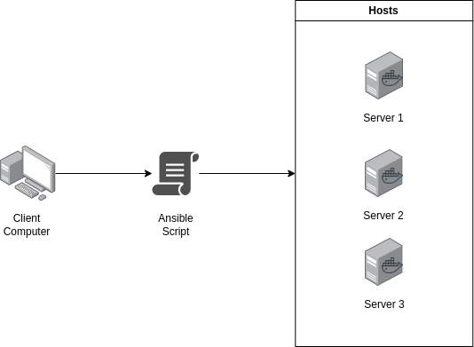

# Ansible Docker Compose

Run docker-compose on multiple hosts



## Setup

1. Replace `remote_user` and `private_key_file` with correct settings in `ansible.cfg`

2. Replace `ansible_host` and `ansible_user` with correct settings in `inventory` file

3. Replace `src`, `dest`, `command` and `chdir` with correct paths

## Run

```bash
ansible-playbook run_docker_compose.yaml -i inventory --extra-vars "ansible_sudo_pass=<sudo_password>"
```
